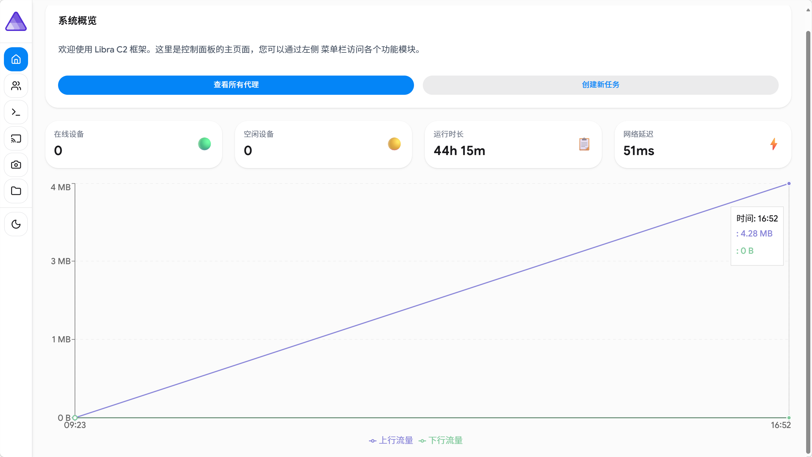
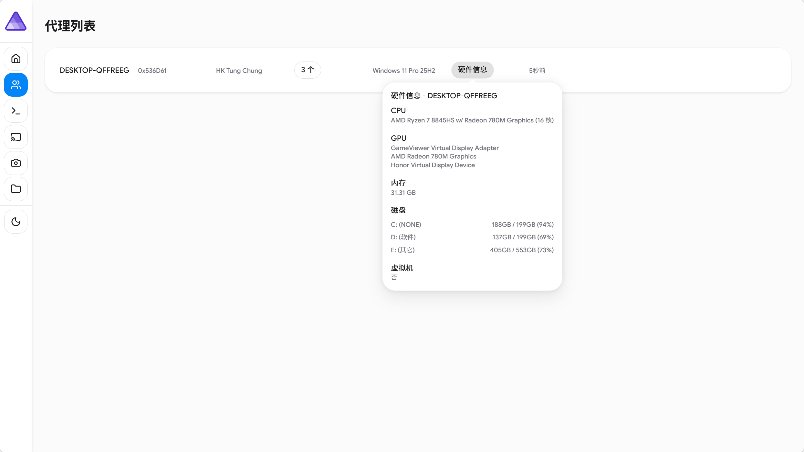
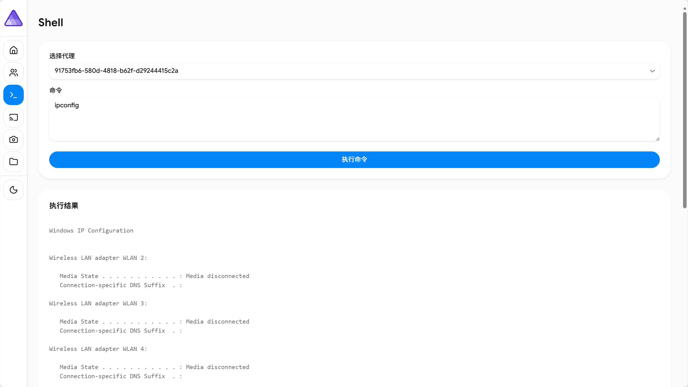
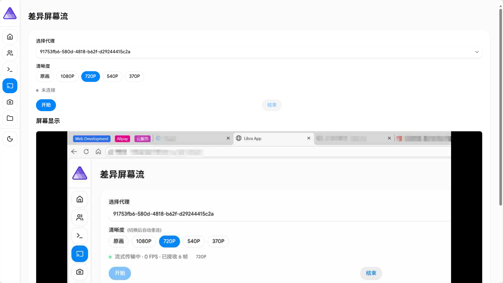
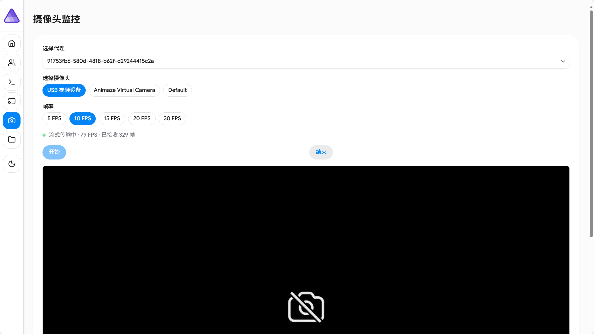
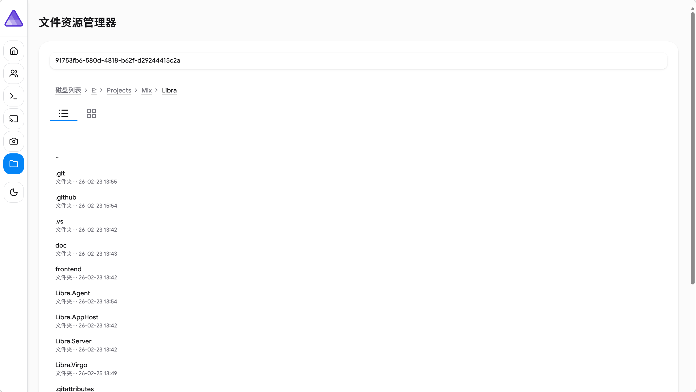

# Libra

一个基于 .NET 10 的远程管理与监控框架，采用 C/S 架构，支持实时屏幕监控、摄像头流、文件管理、远程Shell等功能。

## 项目结构

```
Libra.sln
├── Libra.Server        # ASP.NET Core 服务端
├── Libra.Agent         # Windows 客户端
├── Libra.Virgo         # 共享传输协议库
├── Libra.AppHost       # .NET Aspire 编排
└── frontend/           # React + TypeScript 前端
```

## 技术栈

- **Server**: ASP.NET Core 10, JWT 认证, OpenTelemetry, SSE 推流
- **Agent**: .NET 10 AOT
- **Transport**: TCP + 4字节大端长度前缀 + JSON, 自定义 Virgo 协议
- **Frontend**: React, TypeScript, HeroUI

## 功能

- 实时屏幕监控（差异帧压缩，SSE 推流）
- 摄像头实时流（多摄像头，可调 FPS）
- 远程 Shell 执行
- 文件浏览与下载
- 进程管理
- TOTP 双因素认证

## 快速启动

### 环境要求

- [.NET 10 SDK](https://dotnet.microsoft.com/download)
- [Node.js](https://nodejs.org/) (前端)
- Windows（Agent 仅支持 Windows）

### 1. 克隆项目

```bash
git clone <repo-url>
cd Libra
```

### 2. 启动服务端

```bash
dotnet run --project Libra.Server
```

服务端默认在 `8888` 端口监听 Agent TCP 连接，HTTP API 在默认端口提供服务。

### 3. 启动前端

```bash
cd frontend
npm install
npm run dev
```

### 4. 启动 Agent（Windows）

```bash
dotnet run --project Libra.Agent
```

Agent 启动后会自动连接服务端并注册。

### 使用 Aspire 编排（可选）

```bash
dotnet run --project Libra.AppHost
```

一键启动所有服务。

### AOT 发布 Agent

```bash
dotnet publish Libra.Agent -c Release -r win-x64
```

### 已知Bug：
- 1.Libra.Agent在进行AOT发布时，会对FlashCap进行代码裁剪，导致摄像头监控不可用。
- 解决方法：在发布时不进行裁剪代码，但会导致生成的文件体积增加

## 使用截图








## 免责声明

本项目仅供安全研究、教学演示和授权测试使用。使用者必须遵守所在地区的法律法规。

**在使用本项目前，请确认：**

1. 你已获得目标系统所有者的明确书面授权
2. 你的使用场景符合当地法律法规
3. 你不会将本项目用于任何未经授权的访问、监控或攻击行为

**作者声明：**

- 本项目按"原样"提供，不提供任何形式的明示或暗示担保
- 作者不对因使用或滥用本项目造成的任何直接或间接损失承担责任
- 任何因违反法律法规使用本项目所产生的后果，由使用者自行承担
- 本项目不鼓励、不支持任何非法活动

未经授权对计算机系统进行访问、监控或控制是违法行为，可能导致严重的刑事和民事责任。

## 协议

本项目采用 [GPL-3.0](LICENSE) 许可证。


## 捐赠
- 如果喜欢这个项目，你可以选择请我喝一杯咖啡，以支持我继续开发。


- 以茉莉之名，向天秤座示爱，愿你勿忘我。春江月。
